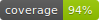

# PHP SDK for the SqualoMail API





## About
**Disclaimer: This is not an official SDK.**

With this package you can use the SqualoMail API in your PHP project. 

## Requirements
- PHP >= 7.4
- CURL and JSON PHP extensions

## Installing
Download it with composer: 
```shell
composer require datalinx/squalomail-php-sdk
````

## Usage
```php
$api = new API('your API key here');

$request = new CreateRecipient($api);
$request->email = $test_email;
$request->name = 'John';
$request->surname = 'Doe';

try {
    $response = $request->send();
    
    // Subscribed, see the CreateRecipientResponse class for details
    echo $response->getRecipient()->id;
}
catch (Exception $exception) {
    echo 'Oops, something went wrong: '. $exception->getMessage();
}

```

### Requests implementation
All API endpoints are specified [here](https://api.squalomail.com/v1/help).  
However, only the following are implemented in this package currently.

| Request               | Notes                                                                                                                                       |
|-----------------------|---------------------------------------------------------------------------------------------------------------------------------------------|
| Create recipient      |                                                                                                                                             |
| Get recipient         |                                                                                                                                             |
| Get recipient's lists | See the `GetRecipientLists` class docblock for explanation.                                                                                 |
| Update recipient      | You can provide either the recipient ID or the email. If you provide both, the email address for the matching recipient ID will be updated. |
| Delete recipient      | You can delete recipients only by ID, so fetch the ID with a `GetRecipient` request first.                                                  |
| Create list           |                                                                                                                                             |
| Delete list           |                                                                                                                                             |
| Get list recipients   | Does not support pagination                                                                                                                 |
| Subscribe by email    | This works only for recipients that are already created.                                                                                    |
| Unsubscribe by email  |                                                                                                                                             |

## Contributing
If you have some suggestions how to make this package better, please open an issue or even better, submit a pull request.

### Developer documentation
* [Official SqualoMail API documentation](https://www.squalomail.com/sl/podpora/sistemski-api/) (in Slovenian and Italian only)
* [Endpoint list](https://api.squalomail.com/v1/help)
